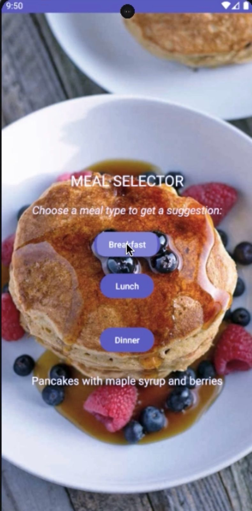
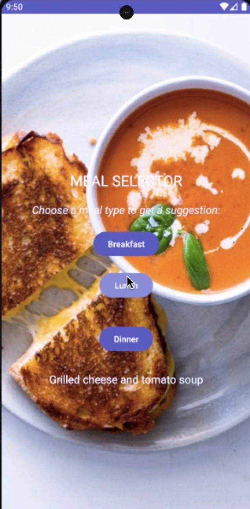
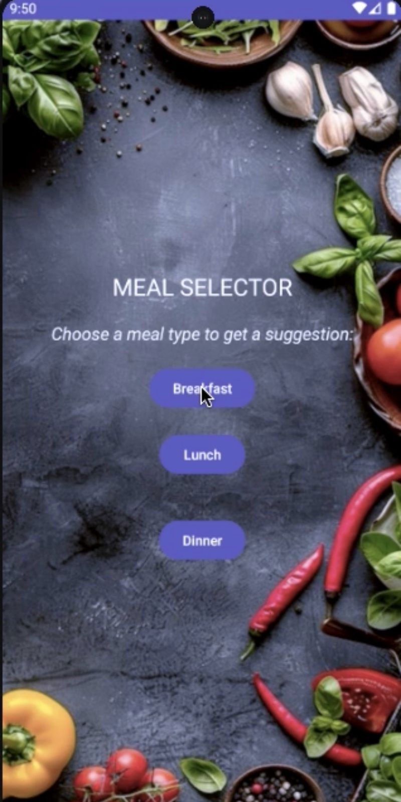
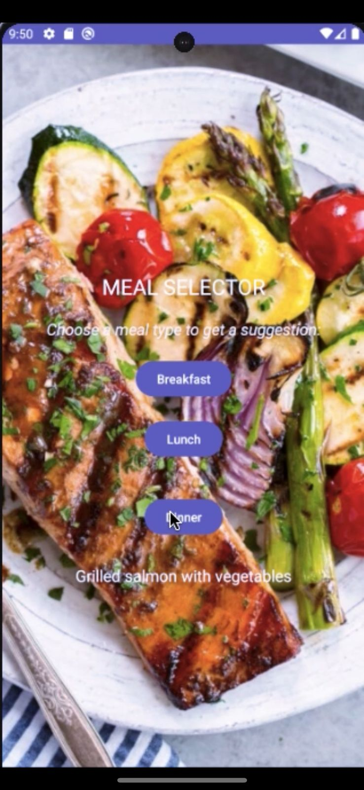

# 🍽️ Meal Selector App

## 📱 Overview
The **Meal Selector App** is a simple Android application that provides random meal suggestions for breakfast, lunch, or dinner. With just a tap on a button, users can get a random meal idea from a predefined list for each meal type.

## ✨ Features
- 🎲 **Random Meal Suggestions** for Breakfast, Lunch, or Dinner
- 🖼️ **Simple UI**: Three buttons for meal types and a display area for suggestions
- 👍 **User-friendly**: Quick and easy to use, with a tap to get meal suggestions

## 📸 Screenshots
<div align="center">
  
  
  
  
</div>

## 🎬 Features Demo
Check out our YouTube short demonstrating the app's features:

[](https://youtube.com/shorts/q4bhmgizwP4?si=iK1v6EaaOOthaWjd)

## 🚀 Installation
1. Clone the repository:
```bash
git clone https://github.com/nuriyaakbar/mealselectorapp.git
```
2. Open in Android Studio and run the app on a device or emulator.

## ⚙️ How It Works
- 🍳 **Breakfast**: Pancakes, oatmeal, avocado toast, etc.
- 🥗 **Lunch**: Sandwiches, salads, soups, etc.
- 🍝 **Dinner**: Pasta, salmon, curry, etc.

Each button generates a random meal suggestion from the corresponding list.

## 👥 Contributing
Feel free to fork the repo, contribute, or suggest improvements via pull requests.

## 📄 License
Open-source under the MIT License.

## 📚 References
- [Kotlin Docs](https://kotlinlang.org/docs/home.html)
- [Android Developer Guide](https://developer.android.com/guide)
- [Pinterest](https://www.pinterest.com/) - Inspiration for food ideas and UI design
- [ChatGPT](https://chat.openai.com/) - Assistance with development and documentation

---

Made with ❤️ in Kotlin